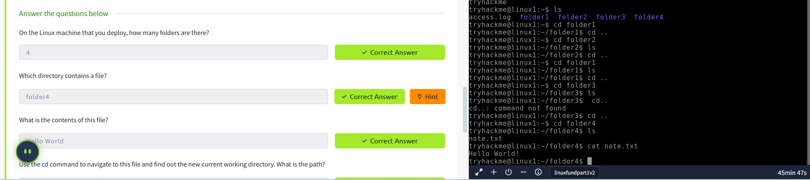
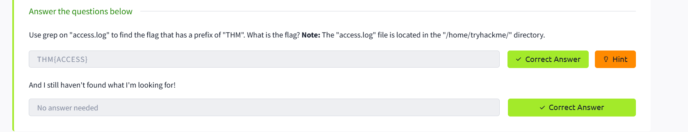
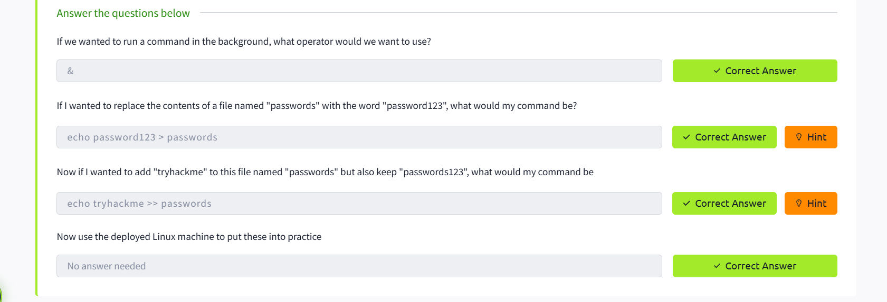

---
---
---
layout: default
title: Erick Mwachia Mwanyumba – Portfolio
---

# Erick Mwanyumba
**ICT Support Officer | Cybersecurity Enthusiast**  
📧 [erickmwanyumba@gmail.com](mailto:erickmwanyumba@gmail.com)  
💻 [github.com/erickcybersec](https://github.com/erickcybersec)  
📞 +254 742 243 940

---

## Professional Summary

ICT Support Officer with 5+ years of experience supporting technical operations across key county departments. Proficient in managing IT infrastructure, digital systems deployment, and offering frontline cybersecurity awareness. Actively pursuing specialization in cybersecurity and systems administration.

---

## Work Experience

- Daily technical user support in Wundanyi Sub County departments.
- Set up and manage VPN, IFMIS systems, and Revenue System integrations.
- Preventive maintenance for hospital and county IT infrastructure.
- Inventory updates and training for ICT interns/attachees.

---

## Education

**Diploma in Information Communication Technology**  
*Machakos University, 2013 – 2015*

---

## Skills

- System User Support & Networking  
- Cybersecurity Fundamentals and Ethical Hacking  
- Computer Repairs & Diagnostics  
- Digital Marketing  
- Git & GitHub

---

## Certifications

- Google IT Support Certificate  
- Cybersecurity Essentials – Cisco Networking Academy  
- Network Server Security Certification  
- CompTIA Cloud+ Advanced  
- Tax Planning 2025 Certification  
- Ethical Hacking Essentials – Cyber Shujaa *(In Progress)*

---

## Projects

**1. Cybersecurity Awareness Campaign (2024)**  
Created and distributed awareness materials to combat phishing and fake CAPTCHA attacks in county offices.

**2. LAIFOMS Offline Server Setup**  
Successfully set up a local area server for revenue system continuity during network outages.

**3. Church Projection System**  
Installed EasyWorship-based triple-screen display system for sermons and church media.

---

## Lab Challenges

### 1. Running Your First Few Commands  
**Tools Used:** Linux Terminal  
**Approach:** Practiced `echo` and `whoami` to understand command-line basics in a non-GUI environment.

### 2. Interacting With the Filesystem  
**Commands Practiced:** `ls`, `cd`, `cat`, `pwd`  
**Approach:** Navigated directories, read files, and printed current directory paths.  

### 3. Searching for Files  
**Commands Practiced:** `find`, `grep`  
**Example:** `find –name ErickCV.doc` – to locate a file by name.  

### 4. Shell Operators  
**Operators Practiced:** `&`, `&&`, `>`, `>>`  
**Approach:** Learned logical and redirection operators to combine and direct command output.  

---

## Contact

- [GitHub](https://github.com/erickcybersec)  
- [Email](mailto:erickmwanyumba@gmail.com)  
- Phone: +254 742 243 940

---

© 2025 Erick Mwanyumba. All rights reserved.

